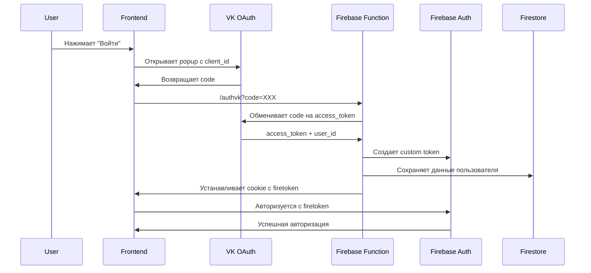
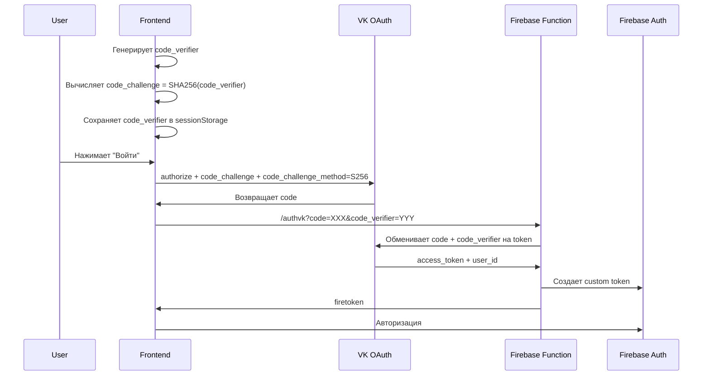
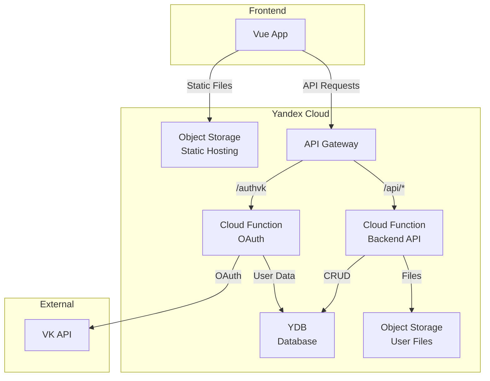

# План восстановления и миграции проекта Кудач

## Текущее состояние проекта

### Технологический стек
- **Frontend**: Vue 2.7 + TypeScript + Vuetify 2 + Vite
- **Backend**: Firebase (Firestore, Auth, Storage, Cloud Functions)
- **OAuth**: VK API для аутентификации
- **Deployment**: Firebase Hosting

### Выявленные проблемы
1. **VK OAuth не работает** - ВКонтакте изменил API, требуется обновление
2. **Устаревшая версия VK API** - используется v5.101, текущая v5.199+
3. **Отсутствие PKCE** - новые требования безопасности VK требуют code_verifier/code_challenge

### Текущая архитектура OAuth



## Фаза 1: Исправление VK OAuth (Приоритет 1)

### 1.1 Анализ изменений VK API

**Ключевые изменения:**
- VK теперь требует PKCE (Proof Key for Code Exchange) для OAuth
- Параметры `code_verifier` и `code_challenge` обязательны
- Обновлена версия API до v5.199+
- Изменены требования к redirect_uri

**Текущие проблемы в коде:**

1. **LoginButton.vue (строка 17)**:
   ```typescript
   // Проблема: отсутствует code_challenge
   `https://oauth.vk.com/authorize?client_id=54313568&display=popup&response_type=code&redirect_uri=${origin}/authvk`
   ```

2. **functions/src/index.ts (строка 36-38)**:
   ```typescript
   // Проблема: отсутствует code_verifier, старая версия API
   const url =
     `https://oauth.vk.com/access_token?client_id=7102165` +
     `&client_secret=${secret}&code=${code}&redirect_uri=${host}/authvk`
   ```

3. **src/vk.ts (строка 85)**:
   ```typescript
   // Проблема: устаревшая версия API v5.101
   const url = `https://api.vk.com/method/${m}?v=5.101&access_token=${token}&${encode(params)}`
   ```

### 1.2 Решение для VK OAuth с PKCE

**Новая архитектура OAuth:**



**Необходимые изменения:**

1. **Добавить утилиты для PKCE** (`src/utils/pkce.ts`):
   ```typescript
   // Генерация code_verifier и code_challenge
   export function generateCodeVerifier(): string
   export function generateCodeChallenge(verifier: string): Promise<string>
   ```

2. **Обновить LoginButton.vue**:
   - Генерировать code_verifier перед открытием popup
   - Добавить code_challenge в URL авторизации
   - Сохранить code_verifier в sessionStorage
   - Передать code_verifier в Firebase Function

3. **Обновить Firebase Function**:
   - Принимать code_verifier из query параметров
   - Передавать code_verifier в VK API при обмене code на token
   - Обновить версию API до v5.199

4. **Обновить src/vk.ts**:
   - Изменить версию API с v5.101 на v5.199

### 1.3 План реализации VK OAuth

**Шаг 1: Создать утилиты PKCE**
- Файл: `src/utils/pkce.ts`
- Функции генерации code_verifier и code_challenge

**Шаг 2: Обновить LoginButton.vue**
- Добавить импорт PKCE утилит
- Генерировать code_verifier/code_challenge
- Обновить URL авторизации VK
- Передать code_verifier в callback

**Шаг 3: Обновить Firebase Function**
- Принять code_verifier из query
- Обновить URL обмена токена
- Обновить версию API

**Шаг 4: Обновить VK API версию**
- Изменить v5.101 на v5.199 в src/vk.ts
- Проверить совместимость методов API

**Шаг 5: Тестирование**
- Локальное тестирование с Firebase emulator
- Тестирование в production

## Фаза 2: Подготовка к миграции на Yandex Cloud

### 2.1 Архитектура Yandex Cloud

**Сервисы для замены Firebase:**

1. **Yandex Database (YDB)** → замена Firestore
   - Document API для совместимости
   - Serverless режим для экономии
   - Автоматическое масштабирование

2. **Object Storage** → замена Firebase Storage
   - S3-совместимый API
   - CDN интеграция
   - Публичный доступ к файлам

3. **Cloud Functions** → замена Firebase Functions
   - Node.js 18+ runtime
   - HTTP triggers
   - Интеграция с YDB и Object Storage

4. **API Gateway** → маршрутизация запросов
   - Замена Firebase Hosting rewrites
   - OpenAPI спецификация
   - CORS настройки

**Новая архитектура:**



### 2.2 Маппинг данных Firestore → YDB

**Коллекции Firestore:**

1. **users** (пользователи)
   ```
   /users/{userId}
   - id: string
   - name: string
   - registerAt: timestamp
   - scope: string[]
   ```

2. **users/{userId}/favorite** (избранное)
   ```
   /users/{userId}/favorite/{eventId}
   - faveAt: string (ISO)
   ```

3. **users/{userId}/balls** (баллы)
   ```
   /users/{userId}/balls/{ballId}
   - type: 'checkin' | 'proposed'
   - balls: number
   - createdAt: timestamp
   ```

4. **events** (события)
   ```
   /events/{eventId}
   - id: string
   - uid: string (VK ID)
   - start: string (ISO)
   - createdAt: string (ISO)
   ```

5. **checkins** (чекины)
   ```
   /checkins/{checkinId}
   - id: string (event ID)
   - user: number (VK user ID)
   - accepted: boolean | null
   - photos: string[]
   - createdAt: string (ISO)
   ```

6. **proposed** (предложенные события)
   ```
   /proposed/{proposedId}
   - id: string (event ID)
   - user: number (VK user ID)
   - accepted: boolean | null
   - createdAt: string (ISO)
   ```

7. **rating** (рейтинг)
   ```
   /rating/{userId}
   - user: number
   - total: number
   ```

**Схема YDB (Document API):**

YDB поддерживает Document API, совместимый с DynamoDB, что позволяет использовать похожую структуру:

```
Tables:
- users (PK: userId)
- user_favorites (PK: userId, SK: eventId)
- user_balls (PK: userId, SK: ballId)
- events (PK: eventId)
- checkins (PK: checkinId)
- proposed (PK: proposedId)
- rating (PK: userId)
```

### 2.3 Миграция Cloud Functions

**Текущие функции:**

1. **authvk** - OAuth авторизация VK
2. **checkinBalls** - начисление баллов за чекины
3. **proposalBalls** - начисление баллов за предложения

**Новая структура Cloud Functions:**

```
functions/
├── authvk/           # OAuth VK
│   ├── index.js
│   └── package.json
├── checkin-trigger/  # Триггер на чекины
│   ├── index.js
│   └── package.json
└── proposal-trigger/ # Триггер на предложения
    ├── index.js
    └── package.json
```

**Изменения в коде:**

1. Заменить `firebase-admin` на `@yandex-cloud/nodejs-sdk`
2. Заменить Firestore API на YDB Document API
3. Настроить триггеры через Yandex Cloud Triggers
4. Обновить переменные окружения

### 2.4 Обновление Frontend

**Файлы для изменения:**

1. **src/db.ts** - основной файл работы с БД
   - Заменить Firebase SDK на YDB SDK
   - Обновить методы работы с данными
   - Сохранить интерфейсы для совместимости

2. **src/store/auth.ts** - аутентификация
   - Заменить Firebase Auth на собственную реализацию
   - Использовать JWT токены
   - Хранить токен в localStorage

3. **src/components/UploadButton.vue** - загрузка файлов
   - Заменить Firebase Storage на Object Storage
   - Использовать presigned URLs для загрузки

4. **.env** - переменные окружения
   ```
   VITE_API_GATEWAY_URL=https://your-gateway.apigw.yandexcloud.net
   VITE_STORAGE_BUCKET=your-bucket-name
   ```

## Фаза 3: Пошаговая миграция

### Этап 1: Настройка Yandex Cloud (1-2 дня)

1. Создать проект в Yandex Cloud
2. Настроить YDB в serverless режиме
3. Создать Object Storage bucket
4. Настроить API Gateway
5. Создать сервисный аккаунт с правами

### Этап 2: Миграция данных (1 день)

1. Экспортировать данные из Firestore
2. Написать скрипт миграции
3. Импортировать данные в YDB
4. Проверить целостность данных

### Этап 3: Разработка Cloud Functions (2-3 дня)

1. Портировать authvk функцию
2. Портировать триггеры для баллов
3. Создать API функции для CRUD операций
4. Настроить триггеры в Yandex Cloud

### Этап 4: Обновление Frontend (2-3 дня)

1. Создать новый SDK для работы с YDB
2. Обновить store модули
3. Обновить компоненты загрузки файлов
4. Обновить конфигурацию

### Этап 5: Тестирование (2-3 дня)

1. Локальное тестирование с эмуляторами
2. Тестирование на staging окружении
3. Нагрузочное тестирование
4. Исправление багов

### Этап 6: Деплой (1 день)

1. Настроить CI/CD для Yandex Cloud
2. Деплой статики в Object Storage
3. Деплой функций
4. Настройка DNS
5. Мониторинг и логирование

## Оценка времени и ресурсов

### Фаза 1: Исправление VK OAuth
- **Время**: 2-3 дня
- **Сложность**: Средняя
- **Риски**: Низкие (можно откатиться)

### Фаза 2: Миграция на Yandex Cloud
- **Время**: 10-14 дней
- **Сложность**: Высокая
- **Риски**: Средние (требуется тщательное тестирование)

### Общее время: 12-17 дней

## Риски и митигация

### Риск 1: Потеря данных при миграции
**Митигация**: 
- Полный бэкап перед миграцией
- Поэтапная миграция с проверками
- Параллельная работа обеих систем

### Риск 2: Несовместимость API
**Митигация**:
- Создание адаптера совместимости
- Постепенный переход модулей
- Тщательное тестирование

### Риск 3: Проблемы с производительностью
**Митигация**:
- Нагрузочное тестирование
- Оптимизация запросов к YDB
- Использование кэширования

## Следующие шаги

1. ✅ Создан план миграции
2. ⏳ Исправить VK OAuth (начать немедленно)
3. ⏳ Изучить документацию Yandex Cloud
4. ⏳ Создать тестовый проект в Yandex Cloud
5. ⏳ Разработать прототип на Yandex Cloud

## Полезные ссылки

- [VK API Documentation](https://dev.vk.com/ru/api/overview)
- [VK OAuth PKCE](https://dev.vk.com/ru/api/access-token/authcode-flow-user)
- [Yandex Database Documentation](https://cloud.yandex.ru/docs/ydb/)
- [Yandex Cloud Functions](https://cloud.yandex.ru/docs/functions/)
- [Yandex Object Storage](https://cloud.yandex.ru/docs/storage/)
- [Yandex API Gateway](https://cloud.yandex.ru/docs/api-gateway/)
